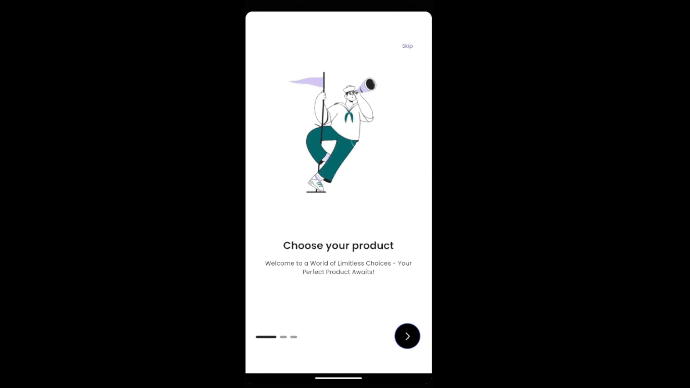
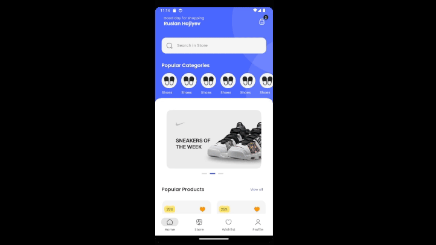

This is an ongoing e-commerce Flutter application, designed to provide a seamless and interactive shopping experience. The project is currently under development, with most of the UI components nearing completion. The backend is being built using Firebase for storage, cloud, and authentication.

Features
State Management: GetX is used for efficient state management.
Advanced Theming: The app employs advanced theming techniques to ensure a consistent and visually appealing user interface.
Structured Folder Organization: The project follows a clean and maintainable folder structure.
Firebase Integration: Firebase is will be used for cloud storage and authentication, although the backend is still in development.
Network Connectivity: Connectivity status is managed using the connectivity_plus package.
Smooth Page Indicators: Implemented using the smooth_page_indicator package for a better user experience.
Carousel Slider: Featured products and promotions are showcased with the carousel_slider.
Rating System: Integrated product rating system with the flutter_rating_bar package.
Progress Indicators: capped_progress_indicator is used to show the progress in various parts of the app.
Expandable Text: The readmore package is used to handle expandable text in product descriptions.

### Start and Home Screen

### Store, Wishlist, Profile Screen
